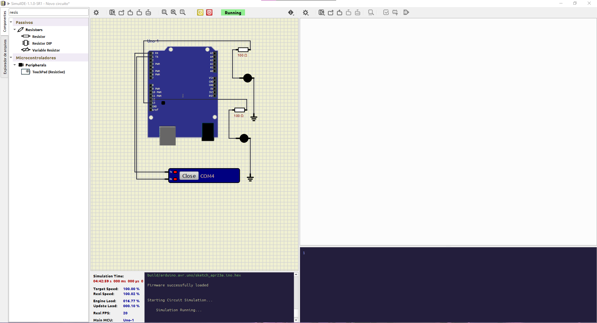

# 🕹️ Jogo de Piscadas com Feedback Físico (Python + Arduino)

Projeto acadêmico integrando visão computacional com dispositivos físicos via Arduino. O jogador mira com o nariz em um alvo na tela e “atira” piscando os olhos. A cada piscada detectada, o jogo verifica se o rosto está posicionado sobre o alvo. Em caso de acerto, o Arduino aciona um LED verde; se errar, acende um LED vermelho.

---

## 🔗 Link do vídeo

- [Link do YouTube](https://www.youtube.com/watch?v=9DPKB-I3yaY)

---

## 🔎 Demonstração

🎯 Mire no alvo com o nariz  
👁️ Pisque para atirar  
💡 LED verde = acerto  
🔴 LED vermelho = erro  

---

## 🛠️ Tecnologias Utilizadas

- Python 3.8+
- OpenCV
- MediaPipe
- pySerial
- Arduino UNO/Nano  
- LEDs + resistores
- Protoboard e cabos

---

## 🖥️ Requisitos

### Software
- Python 3.8+
- Arduino IDE
- SimulIDE
- com0com

### Bibliotecas Python

```bash
pip install matplotlib opencv-python notebook numpy pyserial mediapipe
```

### Hardware
- 1 Arduino UNO ou Nano
- 1 LED verde (pino 13)
- 1 LED vermelho (pino 12)
- 2 resistores de 220Ω
- Protoboard e jumpers

---

## ⚙️ Como Funciona

1. Python usa MediaPipe para detectar malha facial.
2. Calcula o EAR (Eye Aspect Ratio) para identificar piscadas.
3. Detecta a posição do nariz para simular a mira.
4. Ao piscar:
   - Se o nariz estiver sobre o alvo → LED verde.
   - Se estiver fora → LED vermelho.
5. Python envia comando via porta serial para o Arduino.
6. Arduino interpreta e aciona o LED correspondente.

---

## 🔌 Montagem Arduino

| Pino Arduino | Componente |
|:------------|:-------------|
| 13 | LED verde + resistor |
| 12 | LED vermelho + resistor |
| GND | Terra comum dos LEDs |

---

## 📝 Código Arduino

```cpp
void setup() {
  Serial.begin(9600);
  pinMode(13, OUTPUT); // LED verde
  pinMode(12, OUTPUT); // LED vermelho
}

void loop() {
  if (Serial.available()) {
    char comando = Serial.read();
    if (comando == 'G') {
      digitalWrite(13, HIGH);
      delay(200);
      digitalWrite(13, LOW);
    }
    else if (comando == 'R') {
      digitalWrite(12, HIGH);
      delay(200);
      digitalWrite(12, LOW);
    }
  }
}
```

---

## 🖥️ Execução do Jogo

Execute o jogo com:

```bash
python jogo_piscada.py
```

- Pressione a tecla 'q' para encerrar.

---

## 📸 Imagens




---

## :handshake: Colaboradores
<table>
  <tr>
    <td align="center">
        <sub>
          <b>Enzo Luiz Goulart - RM99666</b>
          <br>
        </sub>
        <sub>
          <b>Natan Eguchi dos Santos - RM98720</b>
          <br>
        </sub>
        <sub>
          <b>Kayky Paschoal Ribeiro - RM99929</b>
          <br>
        </sub>
        <sub>
          <b>Gustavo Henrique Santos Bonfim - RM98864</b>
          <br>
        </sub>
        <sub>
          <b>Lucas Yuji Farias Umada - RM99757 </b>
          <br>
        </sub>
    </td>
  </tr>
</table>